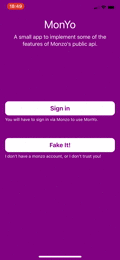

#  MonYo

A little demo app to use some of the features of the monzo api (somewhat repurposed as babylon demo app).

### Note: Some initial experiments adding in some `swiftUI` can be seen on the `iOS13` branch.

---

# Usage

| Auth Flow | Transactions |
| --- | --- |
|  |   |

### Currently implemented

Currently implemented (in a basic way): 
- Authentication flow (specifically the 'Unconfidential' flow,  see [monzo docs](https://docs.monzo.com/#authentication) for more).
- Fetching accounts.
- Fetching transactions (currently from the latest available locally until 'now', and from 1 week back if you do not have any locally).

From the point of view of a user, the accounts fetching portion is not visible, it is simply as a way to get transactions.
We assume that a user only has one active account (and is only interested in that one).

Hence, as a user of the app you can go through the login flow and see a list of your transactions.

For those who don't have a monzo account or don't trust me with an access token (full list of permissions can be seen on the monzo auth page that you are taken to when you tap the 'Sign in' button in the app)... I've added a "Fake it" button. This makes use (or atleast will make use) of some of the machinery in `Debug`. See [Experiments](#Incubating-Libraries-/-Experiments) section for more.

Pull to refresh is also implemented in a basic way, getting only the transactions between now and the last saved locally.

That's about it! It is pretty sparse right now. Oh, and since repourposing this as a babylon demo, there is a `.purple` theme going on.

To build the project requires Xcode 10.2 Although dependencies are managed via cocoapods they are checked into the repo. So opening `Monyo.xcworkspace` and hitting RUN should be enough.

# Development

## Overview

The app as it now can be broken into 3 parts, I'll expand on number 1 below and for 2. check out [Experiments](#Incubating-Libraries-/-Experiments)

1. The application code `/Monyo`
2. Incubating Libraries in `/Incubating Libraries - WIP`
3. Dependencies (managed via cocoapods), and there is only one, just a button class :) in `/Pods` (FWIW I would probably have added a bunch more for clearly scoped things like image caching, instead (again because I was using this project as a bit of a playground) I built a lot from scratch which I shouldn't have necessarily )

### Application Code
The application code is the main codebase for the app. This is a personal project that was originally intended as a test bed for some ideas and libraries.
I have attempted to clean it up but there are still _lots_ of rough edges, largely because of the state of flux of some of the libraries, but I hope enough smooth bits and enough interesting things going on 😅

It is loosely modelled around the ideas of the [`Elm architecture`](https://guide.elm-lang.org/architecture/) / [`Elm Programming language`](https://elm-lang.org).
It may be worthwile familiarising yourself with it but here is some very quick vocabulary (with my non expert understanding) :
- `Model`: A structure that represents the entire state of the application
- `Msg`: Represents an exhaustive set of any inputs that can have an affect on the state of the app
- `Cmd`: A type that represents non deterministic work to be done. This work is performed by the Elm runtime and will eventually result in a Msg
- `Update`:  A pure function `(Msg,Model) -> (Model,Cmd)`
- `View:` A pure function `(Model) -> Html` that can be rendered by the Elm runtime.
- `Program`: A way to connect Model, Update and View into a system that reacts to any commands returned by an `Update` and renders the view produced by the model every time it changes

Yes this is yet another take on it sorry :( . Smarter people have looked into a lot before, and one such person even [aggregated](https://gist.github.com/inamiy/bd257c60e670de8a144b1f97a07bacec) them 😀.

By making Use of the `Program`  library, and following some convention, it is split up into 4 distinct parts
- `Model`: analagous to elm model, The structure that describes the entire state of the app.
- `Update`: analagous to elm update, also contains possible Msgs and we can move any other pure helper functions in here.
- `Commands`: _All_! the side effects that the app can produce. By convention, _anything_ that interacts with the outside world should be here, 
and wrapped in a `Command` structure. This is essentially just a wrapper around a function which performs side effects and calls a callback function with a result when it's done.
This section also contains a `World` which is a way of encapsulating everything that the program needs to interact with in the outside world, not dissimilar to what is described in a [pointfree.co](https://www.pointfree.co/episodes/ep16-dependency-injection-made-easy) episode - and infact one of your own [technical proposals](https://github.com/Babylonpartners/ios-playbook/blob/589b3c605260a3c1563b671145baecf56b0ec546/Cookbook/Proposals/ControlTheWorld.md) (what was the outcome?) . _However_ the boundaries between what is encapsulated there and what could be contained within individual commands are not very well defined (by me, currently) and is potentially a result of mixing up 2 similar but different Ideas. 
- Also by convention taken from `Cont` (`Command` is an alias of a particular type of `Cont` (see [Experiments](#Incubating-Libraries-/-Experiments)) , sideeffects will only be performed when `run` is called. If you follow the convention that all side effects are wrapped in a `Command` then _nothing_ should happen to the Program until a `run` method is called and it's results sent to `Update`
- `UI` ie the View layer: This is much more like the UI you would be used to seeing in iOS apps. `UIViews` and `UIViewControllers`, potentially some helper classes. These should be as slim as possible and by convention most of them have an `update` function that takes a `model` and updates accordingly. I've made no attempt at making declarative views, however I've tried to make them as 'dumb' (I feel like there's a better word for this) as possible.

The `Program` class itself takes `Model`, `Update` (aka `(Msg,Model) -> (Model,Cmd)`) and then has an optional closure that is called everytime the model is updated. This is where you will need to connect the program to the UI. This is done in the app delegate entry point for now. The program exists as a global variable in the app called `Current`
`Program` is generic over `Model` and `Msg`

#### Pre requisite for babylon demo
As I mentioned this project has been somewhat repourposed but I tried to shim these in.
- [X] Use Swift 4.0 or above. 
    - uses Swift 5

- [X] Have at least two distinct network calls.
    - 1 auth call, 1 call for accounts, 1 call for transactions (distinct).
- [X]  Parse the network response and present the information to the user.
    - pretty much everything from monzo is json -> struct and potentially -> UI
- [X] Have some sort of persistence mechanism.
    - The entire model / state of the app is codable :). I persist on app will dissappear, not for any good reason, just as a demonstration. it's just written as json to tmp directory. It's a first step, but I'm quite happy with it as a first step - it also opens it up quite easily for persistence of a _history_ of app states, (which I currently do only in memory with `Debug`)
- [X] Compile and run.
    - works on my machine 🙃
- [X]  Have a point of synchronization (e.g. making two concurrent requests and waiting for both of them to finish). 
    - mostly just to his this point, I've made all calls to fetch transactions split up over a certain number of calls (this can be any number that the developer wishes), splitting up the time frame that I reqiest (on the untested assumption that this might be quicker than a single call for combined time frame). The syncronisation is done as part of the `Cont` library, but since it is a prerequisite I added some tests for it in the app in `MonyoTests/CommandTests.swift`  . Other than that, it so happens that every other relevant asynchronous operation has to be done serially.

#### Interacting with Monzo
There is a fair amount of the model that revolves around data structures that Monzo present, the best thing is probably to skim the [monzo docs](https://docs.monzo.com/#authentication) . Most of the relevant data structures are in the `Monzo` incubating library.

#### How to build new features
With this set up it means we can draw effective lines for building and testing (ignoring the World/Command blur for now).
1. Update the model to include any new state that will be introduced.
2. Add any Msgs that represent new inputs to the program (if they exist)
3. Update the `update` function to deal with any new inputs and any change in behavior
- *Note* - Up until now _everything_ (except the Cmd return value in the update function) consists of pure values and functions. And hence very easy to test confidently. Considering the update function is essentially the entirity of the app's "business logic", you can be fairly confident that the internal logic of your app is sound if you have code coverage of the entire update function.
4. Wrap any side effects that need to be performed as a result of an update (if any) in [a] command structure[s]
- *Note* Currently it is not easy to test these for equality. I have had different thoughts including simply adding an ID to `Command`s and ensuring they are all statically generated... among others. This is something that needs improving, but the surface area is small, see next point...
5. You can test commands each individually as well. (currently) all commands take a `World` parameter that represents any possible dependencies
it has with the outside world. By mocking this, running the command and checking the return value, you can test that your command
interacts with the outside world as you expect and it processes whatever it receives from the outside world correctly.
6. add UI - I make no attempt at a declarative UI and so these will be built in a "normal" iOS way, i.e quite stateful. That being said we have
a very good destination for any complex logic, which is to say almost any decision making should be pushed down to `Update`/`Model` if it makes sense. And arguably for a fixed point in time, trait collection and frame, it is a pure function to a buffer of pixels ☺️
7. Testing the UI can be done by snapshot testing with high confidence. By convention almost all `UIView(Controller)` elements expose an update method
which updates the view based on the `model` (or a subset of it). So to test views we simply setup snapshot tests for any level of isolation of a component we want. (Note, unfortunately I haven't done this in the project yet)

# Incubating Libraries / Experiments 

## Overview
There are 4 separate libraries which I have been messing around with:
1. `Monzo`: This was just an attempt at wrapping the Monzo api. One of my goals was that there would be no stateful classes, just Value structures and functions that could be chained together to make many different types of requests given that the consumer take care of only caching and has some mechanism for turning a url request into data.
2. `Cont`: Building up to what should hopefully be a [Continuation](https://en.wikipedia.org/wiki/Continuation) library. To be honest a lot of this was an extremely interesting learning exercise, more than an attempt to build a library.
3. `Program`: My take on `Elm`'s `Program` (or one flavour of it). It is a little more like a [headless](https://package.elm-lang.org/packages/elm-lang/core/latest/Platform#program) elm program in that it does not produce UI, but it does have a hook for anyone to listen for model changes and do whatever they want to with the latest state of the program. This has enabled the distinction within the app code I talked about previously, and am pretty happy about. There is a lack of `Subsctiptions` here, due mostly to it not being needed yet.
4. `Debug`: This is a jumble of some quite gnarly code, messing around with ideas of what building the app around the concept of a program can give us, again heavily inspired by `Elm`. The main point of interest is being able to go forwards and backwards in time through the different states of your app, and get a visual representation as you do. One that is also half done is a UI to send specific inputs to the current program, which you can also do quite nicely in LLDB with something like `e Current.update(message: .startFetchingTokens)`. Other practicalities include it being able to be loaded at runtime (in progress but mostly there) and dynamically add itself to the view heirarchy. You can reach it by an Edge swipe from the right.

### More on Debug
|  Feature | poorly compressed gif |
| --- | :---: |
| Replayable history of application model |       Edge swipe from the right to show a table view where the rows are each of the `messages` received and the resulting `model` after each message. Clicking on a row will reset to that respective `model`. It will update the view but it will not run any `commands` that may have been assosciated with the update that created this version of the `model`. The UI set up is achieved with some very hacky bounds and transform manipulation and the debug viewController acting as a container for both the history view and the application view.
| Manipulating the state of the app by sending messages |        here we are in lldb and create a variable which is a function that generates a message with 10 random `Transaction`s. called `randomTransactionMessage`. we can then use this to update the program with `e Current.update(message: randomTransactionMessage())`
| Manipulating model directly |      Here we set the `Current.model` to `Model.initial`, check it with `po Current.model` and later send a message to start the aut process  |

# Next steps

Once again (as I feel a little self concious about it) there are many rough edges around, even inside the app code (I take incubating libraries as a given for now).
So there are also plenty of things to do, both cleaning up what is there, and adding more features.

Some (many) ideas:
- "Make impossible states impossible" ([swift (talk) reference](https://talk.objc.io/episodes/S01E153-making-impossible-states-impossible) , [elm reference](https://www.youtube.com/watch?v=IcgmSRJHu_8))  
    - work on model, likely to in the ideal case have some code generated by sourcery if we want to retain codability of the model.
- Divide transaction into sections by day ,some low hanging fruit, currently the transactions are a single list ordered by time 
    - nicely testable model work + simple UI (if we just want to see it working)
- Move to a database for storing transactions (probably the only entitiy that there are enough of to justify this for now) 
    - This can still work will with serialising the model, and having a purely functional update. We can consider  the ["database as a value"](https://www.infoq.com/presentations/Datomic-Database-Value/) and approximate something like an append only database where we enforce a new reference to the database everytime we change it. If we also have an LRU cache on the model we can ensure anything that ends up on the view or interacting with the outside world must first be on the model and hence make a history of our interaction more auditable
- i18n 
    - work on model and probably implementing a half complete version of nslocalised string and a .strings parser.
- Add "balance" as per Monzo's api
    - api call + update model + some UI
- Add "get earlier transactions", i.e when we scroll to the bottom
    - api call + update model + some UI
- Persisting history of app state
    - probably try to push this into debug and make it generic for `program`s.
- Encrypting history and latest app state (maybe bonus, in such a way that a user could give a key to decrypt for developer debugging / sharing state between devices).
- Decoupling Program/App/Debug to make it more portable.
- Decoupling any other of the other libraries.
- Better voice over support, should really start now and make prerequisite for any new views created.
- Process automation 
    - generate test covarage reports, circle integration... etc.
- Nicer UI components

These are not in any order, some are much harder/easier than others, some are higher/lower impact.
I've though briefly about all of them in that there's a nagging feeling that I want them done shrug.

# Thanks for reading

---
